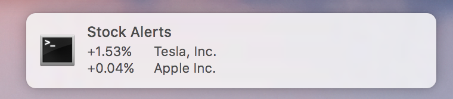

# Stock Alerts

A simple way to get notified of drastic stock ticker changes.



This simple program will give you a desktop notification every 10 minutes about what ever stocks you add to the tracker.

## Install
```
npm i -g stock-alerts
```

## Usage
```
computer$ stockalerts <List of stock symbols>
```

```
computer$ stockalerts tsla aapl msft
```

## Todo

 - [ ] Add the ability to change time intervals
 - [ ] Add persistence of symbols to track
 - [ ] Add % tracking to notify only if a symbol has changed x% a day
 - [ ] Add a better visual cue for positive and negative changes on the alert
